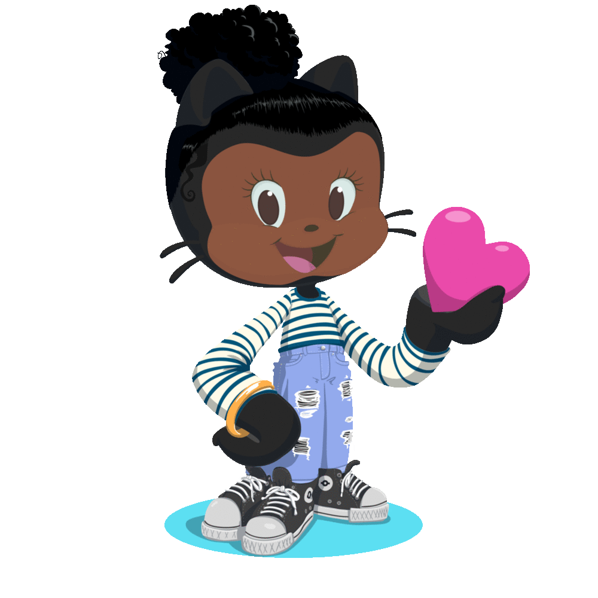

<h1 align="center">Hi 👋, I'm Sandra</h1>
<h3 align="center">A passionate, resourcefull  full stack developer from Belgium interested in developing robust, Full-stack applications that solve business needs.</h3>

I'm a hard worker with a lot of attention to detail & I'm always eager to learn and improve my skills.

 Fuelled by a life-long passion for IT, I use the tools and resources at my disposal to create systems that save time, help people work more effectively and improve over all user experience

  My experience includes working with a wide range of technologies such as Python, Django, Javascript, JQuery, Rest APIs , BooTstrap , CSS & HTML.
 I am confortable working with  SQL(postgreSQL, SQLite, mySQL) & NoSQL(MongoDB) databases.

  

- 🔭 I’m currently working ** learning new skills** 
- 👨‍💻 My top languages & technologies are Python, Django, Flask, SQL, Html, CSS, Materialize, Bootstrap, JavaScipt & Jquery.

- 🌱 I’m currently learning **React Native**

- 👯 I’m looking to collaborate on **open source projects**

- 🤝 I’m looking for help with **Mobile development**

- 👨‍💻 All of my projects are available at [Portfolio](https://atinos31.github.io/)

- 💬 Ask me about **HTML5 |CSS3 | Bootstrap | Django** | Scrum |Project boards | agile | Hackathons
- Professional Interests include Artificial Intelligence, Machine Learning & Data Analysis
- 📫 How to reach me **atinos31.dev@gmail.com**

- 📄 Know about my experiences [Resume](https://atinos31.github.io/resume.html)
- Hackathon collabs: [St.patricks](https://keisgsmit.github.io/Hackathon/), [Mental health](https://metimeminds.herokuapp.com/resources/), [Earth day](http://mother-earth-hackathon.herokuapp.com/), [Betaminds](https://beta-mind.herokuapp.com/), [pride-park](https://pride-park.herokuapp.com/)

- ⚡ Fun fact: **Sarcastic Human**
 
--------------------------------------------------------------------------------------------------------------
 
## Programming Languages

### Frameworks | Libraries | APIs

### Version Control | Coding

### Hosting |Saas

### Databases

### Design | Wireframes

----------------------------------------------------------------------------------------------------------------------------

I'm always working on something cool
---

 

-------------------------------------------------

<h3 align="left">Find me around the Web:</h3>

## Traveller at heart.
---

### Born & Bred In:

---

### Currently Residing In:

##### ✈ Countries Visited🌍
---

 
---

 
---

 
---

 
---

 
---

 
---

 

----------------------------------

... Code away!
